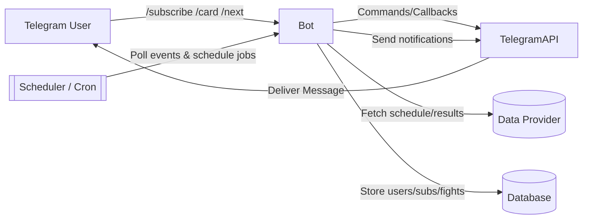
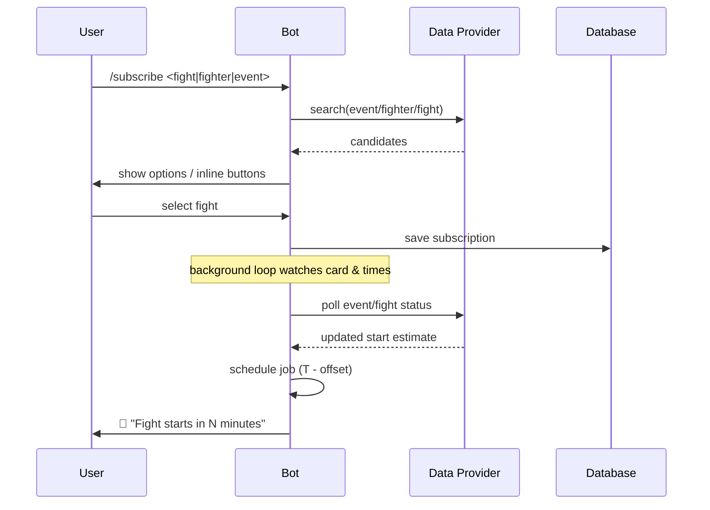

# UFC Fight Notifier – Telegram Bot

Get a Telegram ping **right before** your selected UFC fight starts.
Users pick a fight (or fighter/event), the bot tracks the card, and sends a heads-up X minutes before the bout is expected to walk out.

> ⚠️ Fight times are fluid. This bot handles schedule drift and card reordering as best as the data source allows.

---

## ✨ Features

* Subscribe to a **specific fight** or by **fighter/event**
* Smart notifications: **N minutes before** scheduled start (configurable)
* **Card drift handling** (reordered / delayed fights where data allows)
* Per-user **time zone** and **quiet hours**
* `/next`, `/card`, `/my` commands for quick info
* Works in **polling** or **webhook** mode
* Pluggable data source (official site / ESPN / community API / your scraper)
* Docker-ready, tiny footprint, idempotent migrations

---

## 🔗 Demo

* Try it: `@your_bot_username` (replace with your real bot)
* Short clip / GIF here (optional)

---

## 🧭 Architecture

### Sequence (subscription → notify)

---

## 🕹️ Usage

**Commands**

* `/start` – register and help
* `/subscribe` – search & subscribe by **fight**, **fighter**, or **event**
* `/unsubscribe` – remove a subscription
* `/my` – list current subscriptions
* `/next` – next upcoming fight you’re tracking
* `/card <event>` – show full event card with start estimates
* `/settings` – offset, timezone, quiet hours
* `/timezone <Area/City>` – set your tz (e.g., `Europe/London`)

**Examples**

* `/subscribe Makhachev` → pick fight from inline list
* `/card UFC 307` → returns bout order and live status
* Bot sends: **“Makhachev vs Volkanovski starts in 10 minutes.”**

---

## 🧠 How it works

* The bot periodically **refreshes event state** from your `DATA_PROVIDER`.
* Each fight has:

  * `scheduled_start` (from provider)
  * `order_index` (bout order)
  * `status` (scheduled / live / finished)
* For each user subscription, the scheduler registers a job at
  **`(expected_start - NOTIFY_OFFSET_MINUTES)`**.
  If the card slips, the job **re-schedules** (idempotent).
* Time zones are applied at formatting time per user.

> If the provider exposes **live bout transitions**, we key on those; otherwise we derive estimates from card order + elapsed fights.

---

## 🔒 Privacy & Security

* Stores only what’s necessary (Telegram ID, subscriptions, settings)
* No sharing of user data with third parties
* Rotate bot token on leaks; do not commit `.env`

---

## ⚖️ Legal

* “UFC” and related marks are trademarks of their owners.
  This project is **unofficial** and **not affiliated** with UFC or any broadcaster.
* Respect your data provider’s **Terms of Service** and **rate limits**.

---

## 🤝 Contributing

PRs are welcome. Please:

* Add tests for new behavior
* Keep provider adapters behind clear interfaces
* Update docs if you change env or commands
